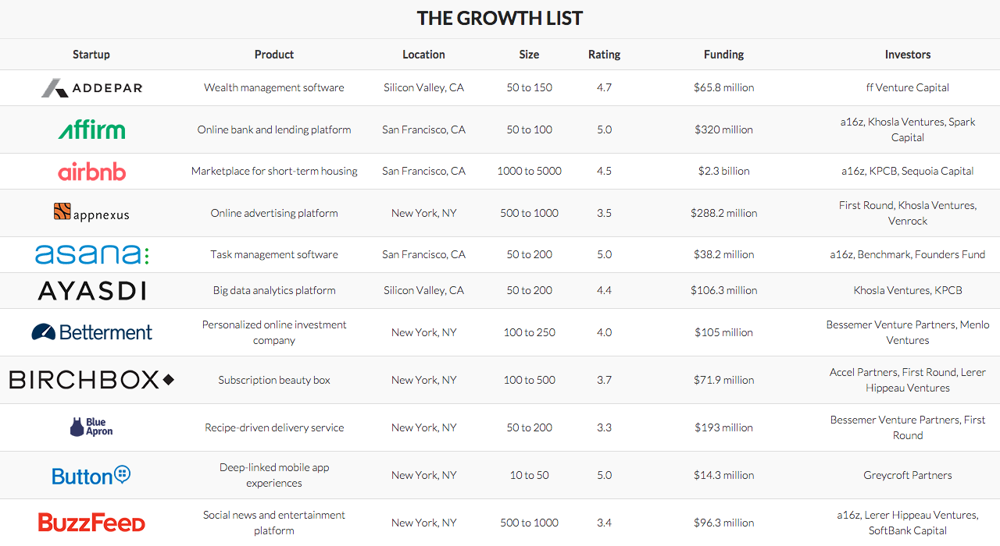

#The Growth List

The Growth List is a list of startups that interest me, whether it's because they're established, billion-dollar companies with solid growth or teams of a few people with big momentum and bigger ideas. The list is inspired by [The Breakout List](http://www.breakoutlist.com), and there's a lot of overlap, but I'm pulling from a running list of companies that I've kept for the past year!

